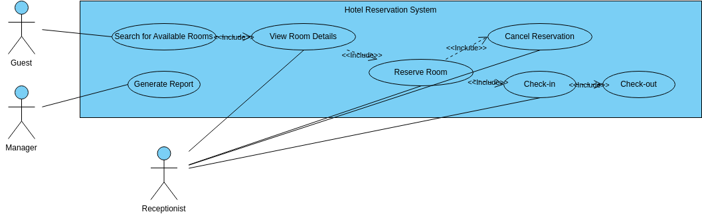

# Requirement Analysis in Software Development

This repository explores the concept of **Requirement Analysis** in Software Development. It covers its definition, importance in the Software Development Life Cycle (SDLC), key activities, types of requirements, use case diagrams, and acceptance criteria, with examples from a booking management system project.

---

## What is Requirement Analysis?

Requirement Analysis is the process of identifying, documenting, and managing the needs and expectations of stakeholders for a software system. It is one of the most critical phases of the **Software Development Life Cycle (SDLC)** because it establishes a clear understanding between stakeholders and developers.  

Without proper requirement analysis, projects risk delays, scope creep, or delivering software that fails to meet user needs.

---

## Why is Requirement Analysis Important?

Requirement Analysis plays a vital role in SDLC because it:

1. **Prevents Miscommunication**  
   Ensures that developers and stakeholders share the same vision of the project.  

2. **Saves Time and Cost**  
   Identifying issues early reduces costly changes during later phases.  

3. **Provides a Clear Roadmap**  
   Guides developers, testers, and stakeholders throughout the project lifecycle.  

---

## Key Activities in Requirement Analysis

The main activities include:

- **Requirement Gathering** – Collecting requirements from stakeholders through interviews, surveys, and brainstorming.  
- **Requirement Elicitation** – Engaging stakeholders to uncover both stated and hidden requirements.  
- **Requirement Documentation** – Recording requirements clearly in formats like SRS (Software Requirement Specification).  
- **Requirement Analysis and Modeling** – Breaking down and analyzing requirements using models, diagrams, and workflows.  
- **Requirement Validation** – Ensuring requirements are correct, complete, and aligned with user needs.  

---

## Types of Requirements

### Functional Requirements
These describe what the system should **do**.  
Example (Booking Management System):  
- Users can **search for available rooms**.  
- Users can **book rooms online**.  
- Admins can **approve or cancel bookings**.  

### Non-functional Requirements
These define **how** the system performs its functions.  
Example (Booking Management System):  
- The system should handle **up to 500 concurrent users**.  
- The booking confirmation should be processed **within 2 seconds**.  
- The system must be **accessible on mobile devices**.  

---

## Use Case Diagrams

**Use Case Diagrams** visually represent the interactions between users (actors) and the system. They help in understanding system functionality at a high level.  

Example: Booking Management System  

  

---

## Acceptance Criteria

**Acceptance Criteria** define the conditions that must be met for a feature to be considered complete and acceptable to stakeholders. They ensure clarity and alignment between developers and business needs.  

Example (Checkout Feature in Booking System):  

- The system should allow users to **review booking details** before checkout.  
- The system must **display total cost**, including taxes and fees.  
- Payment must be processed securely, and the user should receive a **confirmation email** within 5 minutes.  
- Checkout should work across **web and mobile platforms**.  

---

## Repository Structure

